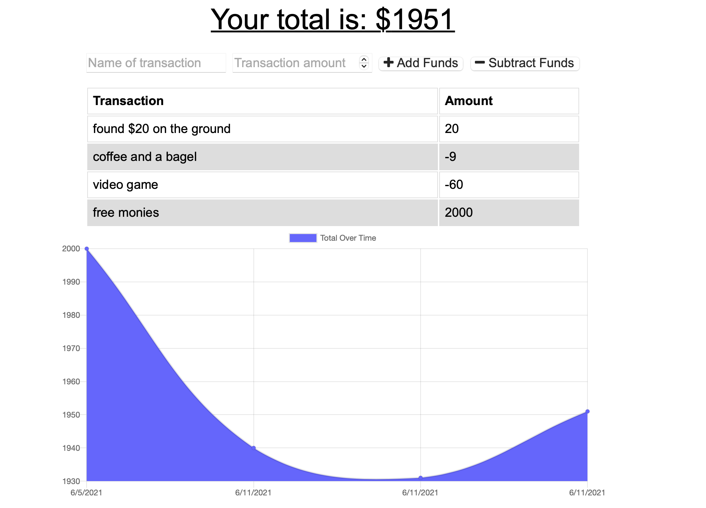

# budget-tracker

## Description

Keep track of your money with this simple budget tracker! It's so reliable it will even accept transactons if your intenet connection is down, and it will update as soon as you reconnect!

## Table of Contents

- [Installation](#installation)
- [Usage](#usage)
- [License](#license)
- [Questions](#usage)

## Installation

- Install node if you don't already have it
- Clone this repo
- Navigate to the repo's location on your computer in your terminal
- Run the `npm install` command and wait for the process to finish
- Run `npm start` and navigate to `localhost:3001` in your web browser

## Usage

[🔗 Deployed Link](https://infinite-atoll-60502.herokuapp.com)

## License

Budget Tracker
Copyright (C) 2021  Graham Hall

This program is free software: you can redistribute it and/or modify
it under the terms of the GNU General Public License as published by
the Free Software Foundation, either version 3 of the License, or
(at your option) any later version.

This program is distributed in the hope that it will be useful,
but WITHOUT ANY WARRANTY; without even the implied warranty of
MERCHANTABILITY or FITNESS FOR A PARTICULAR PURPOSE.  See the
GNU General Public License for more details.

You should have received a copy of the GNU General Public License
along with this program.  If not, see <https://www.gnu.org/licenses/>.

## Questions

Direct any questions to [Graham Hall](http://github.com/ghall89) via email at ✉️ ghall89@me.com